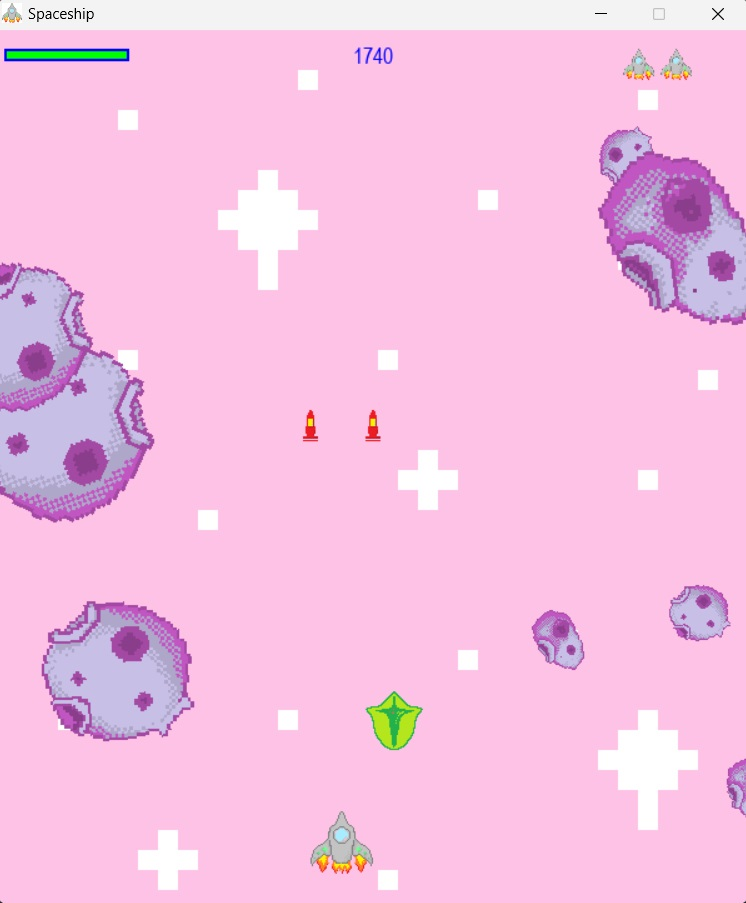

# 太空飛船遊戲

[遊戲下載包](小飛船.zip)

參考教學：Grandma Can [3小時製作一個遊戲](https://www.youtube.com/watch?v=61eX0bFAsYs&t=2112s)

## 遊玩方法

- 按左右鍵操控小飛船移動，按上可發射子彈打隕石，有時候會掉出增加子彈數(閃電)與恢復血量(盾牌)的道具。

- 打越多隕石分數越高，隕石越大科分數越高。

- 被撞到直到寫條耗盡3次時遊戲結束。

## 結構

### 圖片

因擔心有版權問題，且當時覺得像素作品很有趣、漂亮，所以背景、小飛船、子彈、爆炸動畫等，所有素材都是我用小畫家畫的。

### 音效

我是下載 [Youtube Studio 的免費音效](https://studio.youtube.com/)。

## 畫面展示

### 初始畫面

600 x 700

#### 解釋遊戲操作方式

- 按左、右操控小飛船；按上發射子彈。

- 按任意鍵即可開始遊戲。

### 遊戲畫面

左上角為寫條；中間是積分；右上角是復活次數。

最下面是小飛船移動的區塊，到最左或最右邊時會自動從另一邊出現。

